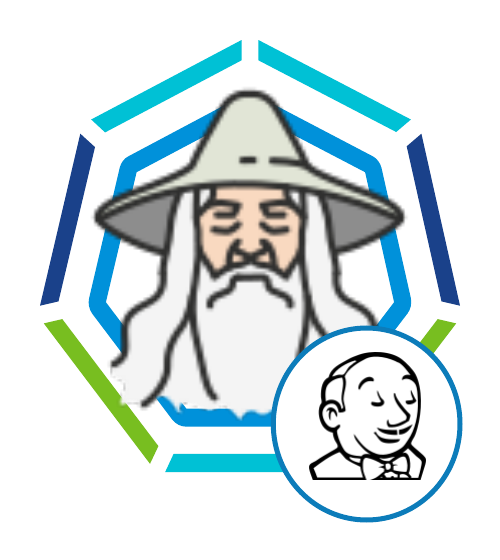

# Jenkins on k8s quick install (bootstrapped docker)

 


For details step by step deployment follow [DETAILS.md](DETAILS.md)

This is a bootstrapped docker that will
- Have all necessary components to deploy jenkins on cluster
- a bash script that will deploy jenkins on a k8s cluster
  - this assumes that cluster is on vsphere with Tanzu 
  - on other cloud coming soon
  - the bash script will auto gain access to k8s cluster based on the input on .env file 
  - and deploy jenkins on k8s cluster in a namespace called jenkins (namespace will be created as well).
  - The bash script will do the deployment process only once (the first time it runs it) and mark it as complete (by adding COMPLETE=yes) in the .env file.
- After the install bash script will mark it as complete and expose access to shell. 


## input through .env

mv ~/.env.sample ~/.env

- BASTION_HOST={ip of bastion/jump host. Leave blank if you have direct connection}
- BASTION_USERNAME={if the above is present then the username for the above}
- TKG_SUPERVISOR_ENDPOINT={find the supervisor endpoint from vsphere (eg: Menu>Workload management>clusters>Control Plane Node IP Address)}
- TKG_VSPHERE_CLUSTER_NAME={the k8s cluster your are trying to access}
- TKG_VSPHERE_CLUSTER_ENDPOINT={endpoint ip or hostname of the above cluster. Grab it from your vsphere environment. (Menu>Workload Management>Namespaces>Select the namespace where the k8s cluster resides>Compute>VMware Resources>Tanzu Kubernetes Clusters>Control Plane Address[grab the ip of the desired k8s])}
- TKG_VSPHERE_CLUSTER_USERNAME={username for accessing the cluster}
- TKG_VSPHERE_CLUSTER_PASSWORD={password for accessing the cluster}
- DOCKERHUB_USERNAME={dockerhub username -- needed to avoid the dockerhub rate limiting issue}
- DOCKERHUB_PASSWORD={dockerhub password -- needed to avoid the dockerhub rate limiting issue}
- DOCKERHUB_EMAIL=
- SELFSIGNED_CERT_REGISTRY_URL={pvt registry domain. If you have private registry where jenkins will be pushing docker images to and the registry is using a self-signed cert then you must tell jekins that.}


## Docker build and run

```
docker build . -t jenkinsonk8s
docker run -it --rm -v ${PWD}:/root/ --add-host kubernetes:127.0.0.1 --name jenkinsonk8s jenkinsonk8s /bin/bash
```

## Configure k8s cloud in Jenkins controller

When installed first time jenkins is going to locked. Get the 1 off unlock password from logs.

`kubectl logs jenkins-664975b99d-schjz -n jenkins`

Jenkins password: ad156080e16b4a3aa9ea9e64df90df6f

Get the IP for Jenkins:

`kubectl get svc -n jenkins`

// Jenking IP: 192.xxx.xxx.xx


1. Open jenkins using the externalIP address that is received after deploying the jenkins service. On first load Jenkins will prompt in locked mode to with input for password. Input the password you recorded from the log file in STEP 3.
2. Jenkins will prompt for installing plugins. I chose "suggested plugins" option. Jenkins will install these plugins. This should take few seconds.
3. Jenkins will prompt for first user. I entered the details for admin user.
4. Jenkins will prompt for URL. In my case by default the service externalIP was in the url http://<IP ADDRESS>. I used this one.
5. Jenkins is now ready to go. But we still need few more plugins for our CI and CD pipeline.
6. Install additional plugins:
   - For jenkins to work with kubernertes we "Kubernetes Plugin". To install 
     - Go to Manage Jenkins > Manage Plugins > Available (Tab)
     - Search for 'Kubernetes'> Select to Install > Then restart
     
     If for some reason after 5-6 mins you do not see restart automatically happening refresh the page and it will take you to login.

     Login using the user you created.
     
     Go to Manage plugin and check if kubernetes plugin was installed or not.

7. Install Below Additional Plugins:
    - Kubernetes
    - Pipeline Utility Steps
    - Kubernetes CLI

8. Add below Credentials via (Jenkins > Manage Jenkins > Manage Credential > Global > Add Credential):
    - **github-cred**: Repository (Github or Bitbucket or whatever your respository is) credential as Username Password type credential
    
    - **dockerhub-cred**: Dockerhub credential as Username Password based. This is needed because of this recent change in Dockerhub :https://www.docker.com/increase-rate-limits.

    - **harbor-cred**: Harbor (My private registry) credential as username password based

    - **jenkins-robot-token**: Kubetoken for K8 SA for K8 deployment of type Secret Text. (See below instruction on how to generate this token). We will use this secret in pipeline. *Note: This service account and token to be created in target cluster, the k8s cluster where you will be deploying your applications. NOT jenkins cluster. If you have deployed Jenkins in the same cluster as your workload cluster then continue in the same cluster other wise switch to the target cluster and create the below. If your target cluster is not ready now you can skip this for now and do this step once there is a target k8s cluster for your workload. If there are multiple k8s cluster then do this in every cluster.*


## Creating K8 Token for deployment using Jenkins


***Note: This service account and token to be created in target cluster, the k8s cluster where you will be deploying your applications. NOT jenkins cluster. If you have deployed Jenkins in the same cluster as your workload cluster then continue in the same cluster other wise switch to the target cluster and create the below. If your target cluster is not ready now you can skip this for now and do this step once there is a target k8s cluster for your workload. If there are multiple k8s cluster then do this in every cluster.***

#### Create a ServiceAccount named `jenkins-robot` in the namespace.


`kubectl -n <namespace eg: calc-k8-cluster> create serviceaccount jenkins-robot`

**OR**

`kubectl apply -f calc-devops/kubernetes/global/jenkins-service-account.yaml`

#### The next line gives `jenkins-robot` administator permissions for this namespace.
*You can make it an admin over all namespaces by creating a `ClusterRoleBinding` instead of a `RoleBinding`.*
*You can also give it different permissions by binding it to a different `(Cluster)Role`.*

`kubectl -n <namespace eg: calc-k8-cluster> create rolebinding jenkins-robot-binding --clusterrole=cluster-admin --serviceaccount=<namespace eg: calc-k8-cluster>:jenkins-robot`

**OR**

`kubectl apply -f calc-devops/kubernetes/global/jenkins-rbac.yaml`

#### Get the name of the token that was automatically generated for the ServiceAccount `jenkins-robot`.

`kubectl -n calculator get serviceaccount jenkins-robot -o go-template --template='{{range .secrets}}{{.name}}{{"\n"}}{{end}}'`

this should output something like this: jenkins-robot-token-9jzfp

#### Retrieve the token and decode it using base64.

`kubectl -n calculator get secrets jenkins-robot-token-9jzfp -o go-template --template '{{index .data "token"}}' | base64 -d`

The namespace here is calculator because that's the namespace where Kubeneter CLI plugin will deploy the workload (not where Jenkins is running). This will output the token. 

**Copy the token and paste it in the secret text of "jenkins-robot-token"**


STEP 6: Configure the Kubernetes plugin:
=========================================
- Go to Manage Jenkins > Manage Nodes & Clouds > Configure clouds
- Click: Add new cloud > Select: Kubernetes
- As Jenkins is running on Kubernetes (Namespace: jenkins in this case) I did not need to provide a separate url for it.
- Below conf:
  - After installing kubernetes-plugin for Jenkins
  - Go to Manage Jenkins | Bottom of Page | Cloud | Kubernetes (Add kubenretes cloud)
  - Fill out plugin values
    - **Name**: kubernetes
    - **Kubernetes URL**: 
    - **Kubernetes Namespace**: jenkins
  - Credentials | Add | Jenkins (Choose Kubernetes service account option & Global + Save)
  - Test Connection | Should be successful! If not, check RBAC permissions and fix it!
  - Jenkins URL: http://<Service IP>:8080
  - Tunnel : <Service IP>:50000
- Save

# That's it

**Now Jenkins is good to go with Kubernetes and will scale per job.**

Checkout sample Jenkins file here: 