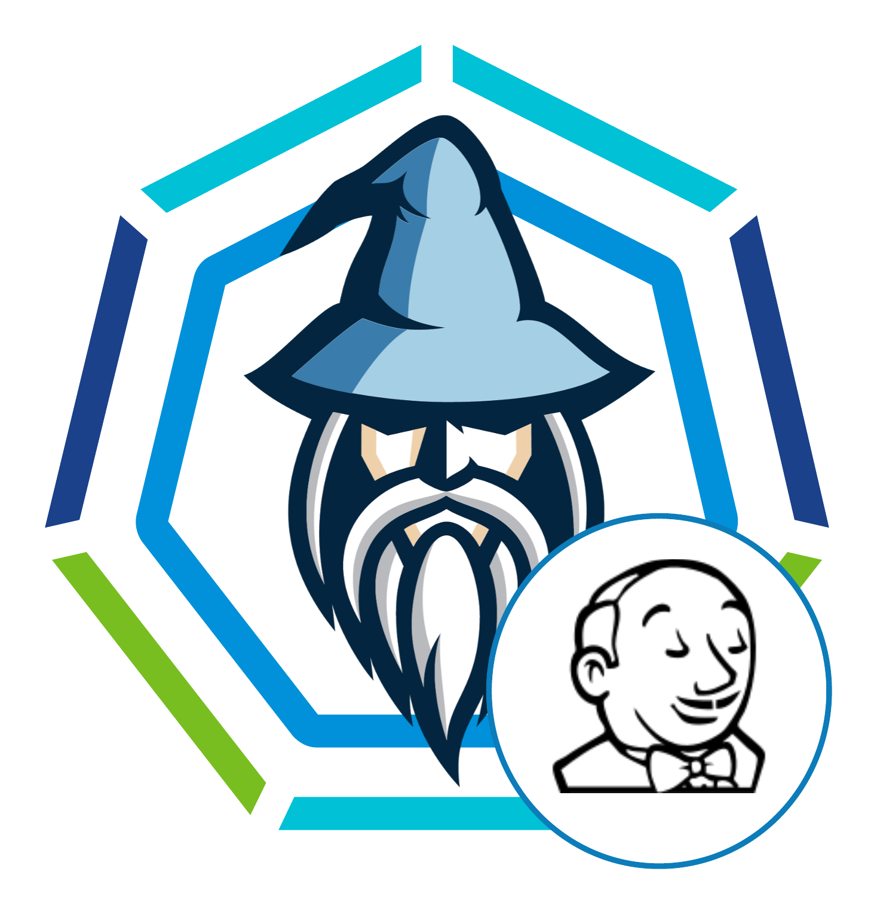

# Jenkins on k8s quick install (bootstrapped docker)

 

For details step by step deployment follow [DETAILS.md](DETAILS.md)

This is a bootstrapped docker that will
- Have all necessary components to deploy jenkins on cluster
- a bash script that will deploy jenkins on a k8s cluster
  - the bash script will auto gain access to k8s cluster based on the input on .env file 
  - and deploy jenkins on k8s cluster in a namespace called jenkins (namespace will be created as well).
  - The bash script will do the deployment process only once (the first time it runs it) and mark it as complete (by adding COMPLETE=yes) in the .env file.
  - It will also create and configure necessary plugins for jenkins running on k8s (eg: kubernetes, kubernetes cli, pipeline utility etc plugin configured)
  - It will also create a sample pipeline based on the user input
    - integrating with TBS OR
    - integrating with container registry directly
- After the install and necessary configs the wizard will display default first login url and password

## Prepare

### Local environment
Local machine with docker-ce or docker-ee installed on it.

### .ENV

`mv .env.sample .env`

***If you are using your own kubeconfig file please place the kubeconfig file in .kube/config (`cp /path/to/myown_kubeconfig_file .kube/config`) and ignore the TKG inputs below.***

- BASTION_HOST={(Optional) ip of bastion/jump host. *Leave empty if you have direct connection*}
- BASTION_USERNAME={(Optional) if the above is present then the username for the above. *Leave empty if you have direct connection*}
- TKG_VSPHERE_SUPERVISOR_ENDPOINT={(Optional) find the supervisor endpoint from vsphere (eg: Menu>Workload management>clusters>Control Plane Node IP Address). *Leave empty if you are providing your own kubeconfig file in the .kube directory*}
- TKG_VSPHERE_CLUSTER_NAME={(Optional) the k8s cluster your are trying to access. *Leave empty if you are providing your own kubeconfig file in the .kube directory*}
- TKG_VSPHERE_CLUSTER_ENDPOINT={(Optional) endpoint ip or hostname of the above cluster. Grab it from your vsphere environment. (Menu>Workload Management>Namespaces>Select the namespace where the k8s cluster resides>Compute>VMware Resources>Tanzu Kubernetes Clusters>Control Plane Address[grab the ip of the desired k8s]). *Leave empty or ignore if you are providing your own kubeconfig file in the .kube directory*}
- TKG_VSPHERE_USERNAME={(Optional) username for accessing the cluster. *Leave empty or ignore if you are providing your own kubeconfig file in the .kube directory*}
- TKG_VSPHERE_PASSWORD={(Optional) password for accessing the cluster. *Leave empty or ignore if you are providing your own kubeconfig file in the .kube directory*}
- DOCKERHUB_USERNAME={dockerhub username -- Required to avoid the dockerhub rate limiting issue}
- DOCKERHUB_PASSWORD={dockerhub password -- Required to avoid the dockerhub rate limiting issue}
- DOCKERHUB_EMAIL={provide any email address}
- JENKINS_PVC_STORAGE_CLASS_NAME={Storage class attached to the k8s cluster. Run `kubectl get storageclass` to get a list of storage classes. -- Required}
- TMC_API_TOKEN={*Optional. Only needed if you are using TMC supplied kubeconfig file (and leaving the TKG params empty.)*}

***The below fields are NOT needed in interactive mode (wizard). You can leave the below empty (or delete it). The wizard will fill it. The below values are needed only if you are using this docker in pipeline to provision jenkins)***
- JENKINS_USERNAME=
- JENKINS_PASSWORD=
- JENKINS_SECRET_PVT_REPO_USERNAME=
- JENKINS_SECRET_PVT_REPO_PASSWORD=
- JENKINS_SECRET_PVT_REGISTRY_USERNAME=
- JENKINS_SECRET_PVT_REGISTRY_PASSWORD=
- JENKINS_SECRET_DOCKERHUB_USERNAME=
- JENKINS_SECRET_DOCKERHUB_PASSWORD=
- JENKINS_ROBOT_NAMESPACE=

### Binaries

**Place required binaries in the binaries directory**
- **tmc** (optional) --> required only when you are using tmc supplied kubeconfig

### Kubeconfig (optional)

***If your k8s cluster is a TKG cluster in vSphere AND you have TKG values filled in your .env file (as mentioned above) skip this section.***

If you are accessing the cluster through a kubeconfig file (and not vSphere sso, meaning you have not filled out the TKG values in the .env file) then
- copy the kubeconfig file (eg: `~/.kube/config`) and place it in .kube dir (`cp ~/.kube/config .kube/`) of this location.
- ***Make sure that your the kubeconfig file placed in the .kube dir only contains 1 server endpoint (eg: `server: https://my.domain.com:6443`)***
- ***Make sure the name of the kubeconfig file placed in .kube dir is strictly **config** (no extension)***

### Private key file (optional)

If your k8s cluster api server is in a privated cluster, meaning you cannot access the cluster (eg: `kubectl get ns`) from your local machine directly AND the k8s cluster is only accessible through a jump host aka bastion host
- you must supply a private key file named `id_rsa` in the `.ssh` of this directory for the bastion host
- This bootstrap docker container with create a ssh tunnel using the `id_rsa` private key file for authenticating into the bastion host and create ssh tunnel and use relevent port forward. Thus any kubectl commands can be performed locally but will get executed in the remote k8s cluster.


## Docker build and run

### for linux or mac
```
chmod +x start.sh
./start.sh jenkinsonk8s
```

### for windows
```
start.bat jenkinsonk8s
```

***Optionally use a second parameter `forcebuild` to force docker build (eg: `start.sh jenkinsonk8s forecebuild`). Otherwise if the image exists it will ignore building.***

# That's it

**Now Jenkins is good to go with Kubernetes and will scale per job.**

Checkout sample pipeline definition in the sample-java pipeline it will create as part of the deployment. You can save it as Jenkins file for your own pipeline.  